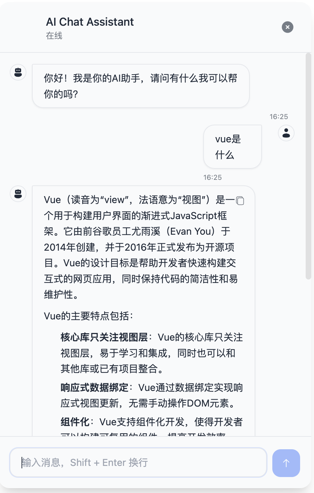

# FS AI Components

基于 Vue 3 的 AI 聊天组件库，支持多种 AI 提供商，提供流畅的用户体验和主题切换功能。

## 特性

- 🎨 自适应亮色/暗色主题
- 🤖 支持多个 AI 提供商
  - OpenAI
  - Claude
  - Kimi
- ✨ 流畅的过渡动画
- 💬 Markdown 消息渲染
- 📋 消息复制功能
- 🎯 TypeScript 支持
- 🎭 自定义主题
- 📚 知识库上传

## 效果




## 开发环境

- Node.js >= 16
- Vue 3
- TypeScript
- Vite

## 安装

```bash
git clone <repository-url>
cd fs-ai-components
npm install
```

## 环境变量配置

创建 `.env` 文件：

```bash
# AI Provider 配置
VITE_AI_PROVIDER=kimi  # 可选：openai, claude, kimi

# OpenAI 配置
VITE_OPENAI_API_KEY=your-api-key-here
VITE_OPENAI_MODEL=gpt-3.5-turbo
VITE_OPENAI_BASE_URL=https://api.openai.com/v1

# Claude 配置
VITE_CLAUDE_API_KEY=your-claude-key-here
VITE_CLAUDE_BASE_URL=your-claude-url-here

# Kimi 配置
VITE_KIMI_API_KEY=your-kimi-key-here
VITE_KIMI_BASE_URL=https://api.moonshot.cn

# 聊天配置
VITE_MAX_MESSAGE_LENGTH=1000
VITE_MAX_HISTORY_LENGTH=50

# 主题配置
VITE_DEFAULT_THEME=light

# 上传配置
VITE_MAX_UPLOAD_SIZE=5242880  # 5MB
VITE_ALLOWED_FILE_TYPES=image/png,image/jpeg,application/pdf
```

## 开发

```bash
# 启动开发服务器
npm run dev

# 构建生产版本
npm run build

# 预览生产版本
npm run preview
```

## 使用示例

```vue
<script setup lang="ts">
import { AiWindow } from './components';

const handleClose = () => {
  console.log('Window closed');
};
</script>

<template>
  <AiWindow
    title="AI 助手"
    position="bottom-right"
    animation="scale"
    @close="handleClose"
  />
</template>
```

## 项目结构

```bash
src/
├── ai/                # AI 提供商相关
│   ├── providers/    # AI 提供商实现
│   ├── chat.ts       # 聊天功能
│   ├── config.ts     # AI 配置
│   └── types.ts      # 类型定义
├── components/       # Vue 组件
│   ├── AiWindow/     # 主窗口组件
│   ├── ChatBox/      # 聊天框组件
│   ├── ChatInput/    # 输入框组件
│   └── Message/      # 消息组件
├── utils/           # 工具函数
└── pages/          # 页面组件
```

## 主要依赖

```json
{
  "@iconify/vue": "^4.3.0",
  "marked": "^15.0.6",
  "vue": "^3.3.4",
  "sass": "^1.83.4",
  "tailwindcss": "^3.3.2",
  "typescript": "^5.0.2"
}
```

## 功能特点

1. 多 AI 提供商支持
   - 支持 OpenAI、Claude、Kimi 等多个 AI 提供商
   - 统一的提供商接口，易于扩展
   - 简单的提供商切换机制

2. 主题系统
   - 自适应亮色/暗色主题
   - 基于 CSS 变量的主题定制
   - 流畅的主题切换动画

3. 消息功能
   - Markdown 渲染支持
   - 代码高亮
   - 消息复制
   - 加载动画

4. 用户界面
   - 响应式设计
   - 流畅的动画效果
   - 自定义位置和大小
   - 优雅的交互体验

## 贡献指南

1. Fork 项目
2. 创建特性分支 (`git checkout -b feature/AmazingFeature`)
3. 提交更改 (`git commit -m 'Add some AmazingFeature'`)
4. 推送到分支 (`git push origin feature/AmazingFeature`)
5. 提交 Pull Request

## 许可证

[MIT License](LICENSE)
